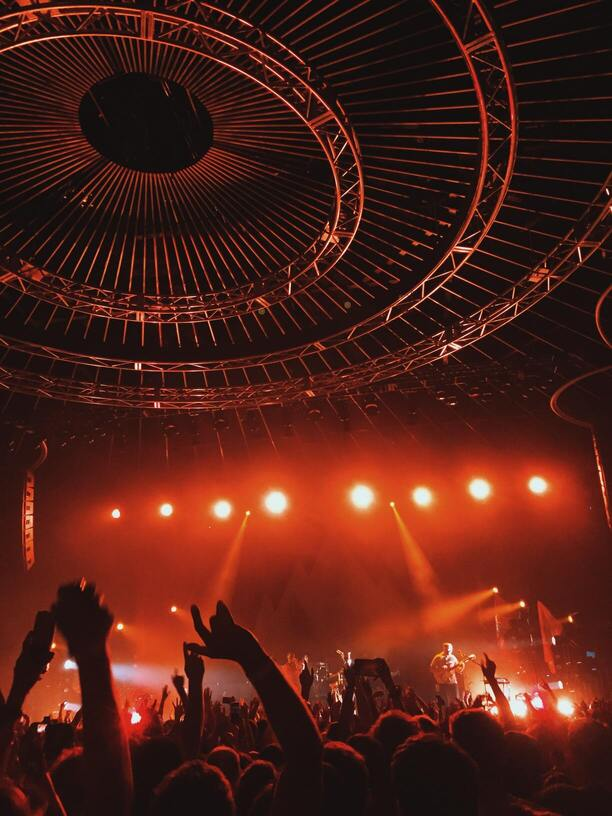
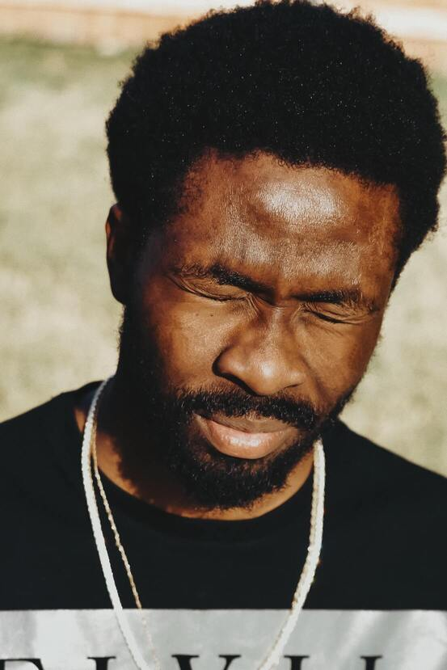
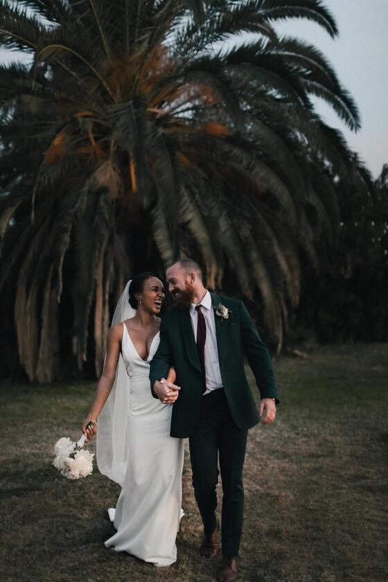
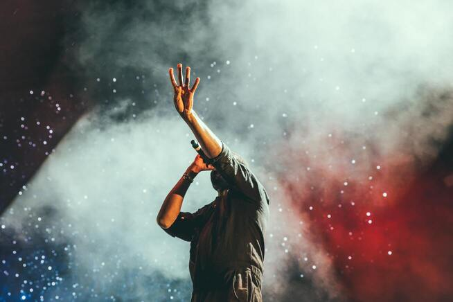

const generatedImages = []; // Tableau pour stocker les images générées

function GenerateGallery(items) {
  for (let i = 0; i < items.length; i++) {
    const item = items[i];
    const img = new Image(); // Créer un nouvel objet Image
    img.className = "gallery-item";
    img.src = item.ImageURL; // Définir la source de l'image
    img.alt = item.alt; // Définir l'attribut alt de l'image
    img.width = "100%";
    img.height = "auto";
    // Ajouter l'image à la galerie une fois qu'elle est préchargée
    img.onload = function() {
      gallery.append(img);
    };

    generatedImages.push(img); // Ajouter l'image au tableau generatedImages
  }
}